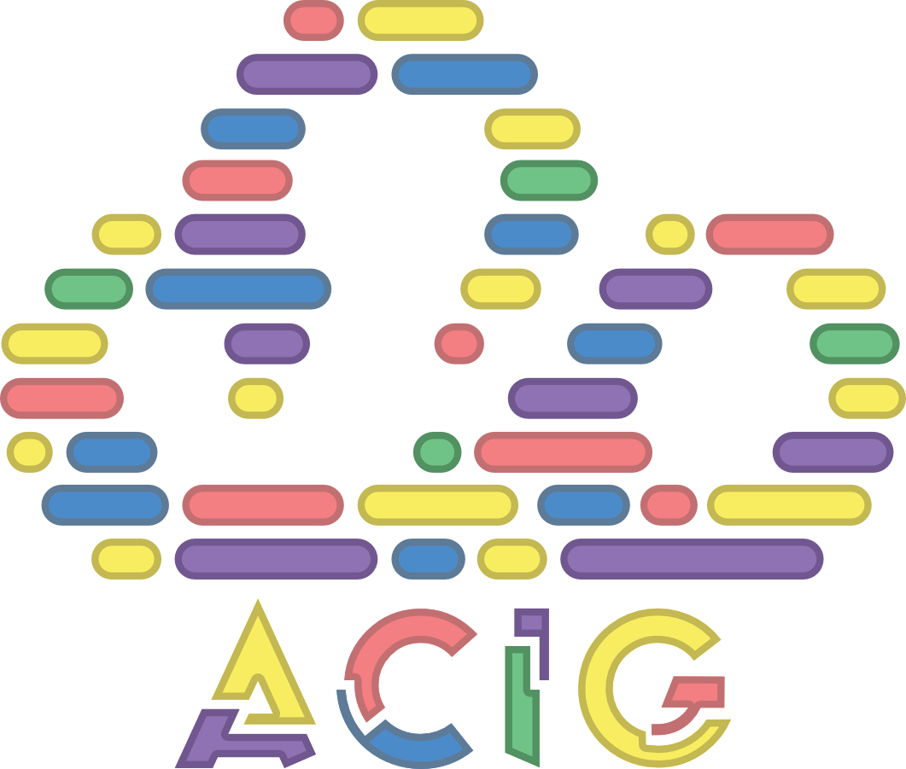

# ACIG – Automatic Composite Image Generation

## Project Overview

ACIG (Automatic Composite Image Generation) provides a cost-effective, modular solution for terrain mapping by reconstructing 3D point clouds from binocular stereo images. The system supports two deployment modes:

* **Hardware Mode**: Real-world data acquisition using stereo cameras on a Raspberry Pi–based platform, suitable for unmanned aerial vehicle (UAV) missions.
* **Synthetic Mode**: Simulated environments powered by Microsoft AirSim and Unreal Engine for rapid prototyping and algorithm validation.

By leveraging stereo vision imagery and depth map information, ACIG transforms paired left-right image sets into high-fidelity 3D reconstructions.

## System Operation (Binocular Vision Method)

1. **Stereo Image Acquisition**
   Two calibrated cameras are mounted at a fixed baseline distance to capture synchronized left and right images of the scene.

2. **Disparity Map Computation**
   Using Semi-Global Block Matching (SGBM), the system computes a disparity map by identifying corresponding pixels between the left and right images.

3. **Depth Triangulation**
   Depth (Z-coordinate) for each pixel is derived from the disparity value, focal length (f), and baseline (b) using the relation:
   $Z = \frac{f \times b}{\text{disparity}}$

4. **Point Cloud Generation**
   Each pixel’s image coordinates (u, v) and computed depth Z are reprojected into 3D space to produce (X, Y, Z) points. Color information is inherited from the original images, yielding an XYZRGB point cloud.

5. **Georeferencing**
   In Synthetic Mode, local 3D points are transformed into geographic coordinates (latitude, longitude, altitude) by combining UAV GPS/IMU data with camera extrinsic parameters.

6. **Point Cloud Registration**
   Multiple point clouds are aligned and merged via Colored Iterative Closest Point (ICP), resulting in a composite 3D model with consistent color and geometry.

---
