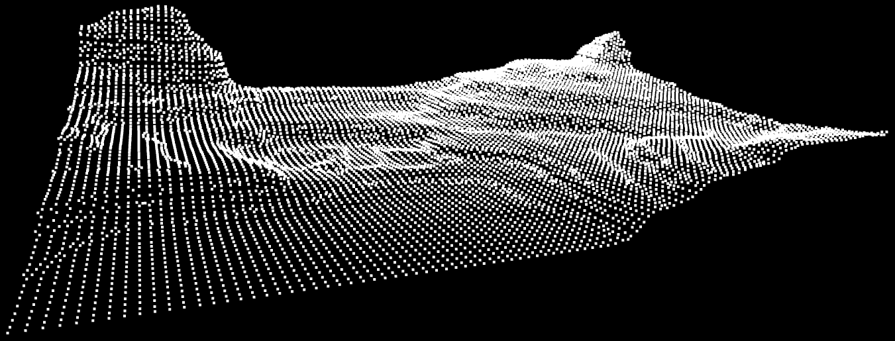

# ACIG – Automatic Composite Image Generation
<div align="center">
  
</div>
## Project Overview

ACIG (Automatic Composite Image Generation) provides a cost-effective, modular solution for terrain mapping by reconstructing 3D point clouds from binocular stereo images. The system supports two deployment modes:

* **Hardware Mode**: Real-world data acquisition using stereo cameras on a Raspberry Pi–based platform, suitable for unmanned aerial vehicle (UAV) missions.
* **Synthetic Mode**: Simulated environments powered by Microsoft AirSim and Unreal Engine for rapid prototyping and algorithm validation.

By leveraging stereo vision imagery and depth map information, ACIG transforms paired left-right image sets into high-fidelity 3D reconstructions.

## System Operation (Binocular Vision Method)

1. **Stereo Image Acquisition**

   Two calibrated cameras are mounted at a fixed baseline distance to capture synchronized left and right images of the scene.
<div align="center">
  
  

_Imagery from **Synthetic Data Environment**. These are the left and right images that we can use as input data for the system._

</div>

---
2. **Disparity Map Computation and Depth Information**

   Using Semi-Global Block Matching (SGBM), the system computes a disparity map by identifying corresponding pixels between the left and right images.
<div align="center">
  

</div>

<div align="center">

  *Depth Information Map*
</div>

---
3. **Point Cloud Generation**

   Each pixel’s image coordinates *(u, v)* and computed depth Z are reprojected into 3D space to produce *(X, Y, Z)* points. Color information is inherited from the original images, yielding an ***XYZRGB*** point cloud.
<div align="center">
    
</div>

<div align="center">

  *Output result of the system.*
</div>

<div align="center">
    
</div>

<div align="center">

  *Visual representation of the points with no color data.*
</div>

---
4. **Georeferencing**
   In Synthetic Mode, local 3D points are transformed into geographic coordinates (latitude, longitude, altitude) by combining UAV GPS data with camera extrinsic parameters.

<div align="center">
    
</div>

<div align="center">

  *On the image above are illustrated three points *(Yellow, Red, Green)* that are picked from the pointcloud. This points are then returned to the user as indexes with their corresponding ***Longitude*** and ***Latitude*** values*
</div>

```
Index: 92971, Longitude: 149.1651245036355 Latitude: -35.362993426389785 | z: 60.21861000778952
Index: 714670, Longitude: 149.16531312045956 Latitude: -35.36302111907015 | z: 91.84780104826757
Index: 1184847, Longitude: 149.16544362451143 Latitude: -35.363039670033906 | z: 170.0
```
---
5. **Point Cloud Registration**

   The system is capable of multiple point clouds alignment via ***Colored Iterative Closesdst Point (CICP)***, resulting in a composite 3D model with consistent color and geometry.

<div align="center">
    
</div>

<div align="center">

  *On the image above are illustrated 7 point clouds that were captured consecutively. The system succesfully alligned the 3d models using CICP.*
</div>

---
